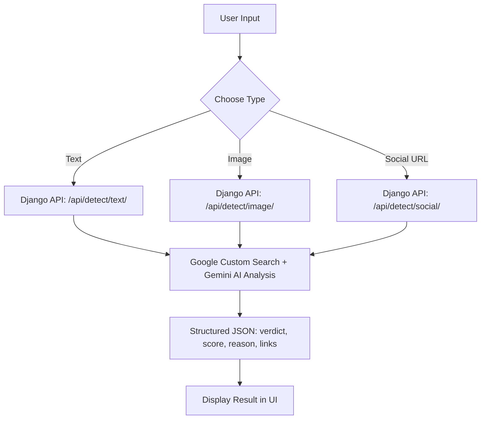

# 🛡️ Truth Guardian AI — Fake News Detection


_Advanced AI-powered tool to detect fake news from **Text**, **Social Media**, and **Images** in real-time._

[](https://truthguardian.vercel.app/)
[](#-chrome-extension)
[](#-streamlit-app)
[](./LICENSE)

---

## 📸 Preview


---

## 📚 Table of Contents

- [✅ Features](#-features)
- [🧠 How it Works](#-how-it-works)
- [🧰 Tech Stack](#-tech-stack)
- [📁 Folder Structure](#-folder-structure)
- [🐍 Django Backend](#-django-backend)
- [🛠️ Next.js Website](#️-nextjs-website)
- [📊 Streamlit App](#-streamlit-app)
- [🧩 Chrome Extension](#-chrome-extension)
- [⚙️ Environment Variables](#️-environment-variables)
- [🤝 Contributing](#-contributing)
- [📜 License](#-license)

---

## ✅ Features

| Category         | Description                                                              |
| ---------------- | ------------------------------------------------------------------------ |
| 🔍 Text Checker   | Detects manipulated or misleading text using NLP and Gemini AI           |
| 🖼️ Image Checker  | Uses Gemini AI multimodal analysis for image authenticity                |
| 🧵 Social Checker | Cross-verifies social media claims using page scraping + AI analysis     |
| 🌐 Browser Ext.   | Chrome Extension (Manifest V3) for real-time detection on any page       |
| 📊 Streamlit App  | Lightweight Python-based interface for testing and analysis              |
| 🐍 Django API     | Django + DRF backend with detection history stored in database           |
| 📈 Realtime Data  | Live AI scoring with confidence meter and evidence links                 |
| ⚙️ SEO Optimized  | Auto-generated sitemap, robots.txt, meta descriptions                    |

---

## 🧠 How it Works



---

## 🧰 Tech Stack

| Layer       | Technology                              |
| ----------- | --------------------------------------- |
| 💻 Frontend  | Next.js 15, React 19, TailwindCSS      |
| 📊 Streamlit | Python Streamlit for UI + testing       |
| ⚙️ Backend   | Django 5 + Django REST Framework        |
| 🧠 AI        | Google Gemini AI API (multimodal)       |
| 🌐 Extension | Chrome Extension (Manifest V3)         |
| 🗄️ Database  | SQLite (dev) / PostgreSQL (production)  |
| ☁️ Hosting   | Vercel (Frontend), Render/Railway (Backend) |

---

## 📁 Folder Structure

```
Truth-Guardian/
├── backend/                        # Django Backend
│   ├── manage.py                   # Django management script
│   ├── requirements.txt            # Python dependencies
│   ├── truth_guardian/             # Django project settings
│   │   ├── __init__.py
│   │   ├── settings.py            # Settings (DB, CORS, API keys)
│   │   ├── urls.py                # Root URL routing
│   │   ├── asgi.py
│   │   └── wsgi.py
│   └── detection/                  # Detection app
│       ├── __init__.py
│       ├── apps.py
│       ├── models.py              # DetectionResult model
│       ├── serializers.py         # DRF serializers
│       ├── services.py            # Gemini AI + search logic
│       ├── views.py               # API views (text/image/social)
│       ├── urls.py                # App URL routing
│       └── admin.py               # Admin panel config
├── frontend/                       # Streamlit App
│   ├── app.py                     # Streamlit interface
│   └── requirements.txt           # Python dependencies
├── extension/                      # Chrome Extension
│   ├── manifest.json              # Manifest V3
│   ├── popup.html                 # Popup UI
│   ├── popup.css                  # Popup styles
│   ├── popup.js                   # Popup logic
│   ├── content.js                 # Content script
│   ├── config.js                  # API endpoint config
│   └── icons/                     # Extension icons
├── website/                        # Next.js Frontend
│   ├── app/                       # App router pages
│   │   ├── api/                   # API routes (proxy to Django)
│   │   │   ├── verify_text_news/
│   │   │   ├── verify_image_news/
│   │   │   └── verify_social_news/
│   │   ├── verify/                # Verification pages
│   │   │   ├── text/
│   │   │   ├── image/
│   │   │   └── social/
│   │   └── result/                # Result display page
│   ├── components/                # Reusable UI components
│   ├── lib/                       # Utilities & API helpers
│   ├── package.json
│   └── ...
├── .env.example                    # Environment variable template
├── README.md                       # This file
├── LICENSE
├── content.png
└── preview.png
```

---

## 🐍 Django Backend

### Setup

```bash
cd Truth-Guardian/backend
python -m venv venv

# Windows
venv\Scripts\activate
# macOS/Linux
source venv/bin/activate

pip install -r requirements.txt
```

### Configure Environment

Create a `.env` file in `backend/`:

```env
DJANGO_SECRET_KEY=your-secret-key
DJANGO_DEBUG=True
DJANGO_ALLOWED_HOSTS=localhost,127.0.0.1
GEMINI_API_KEY=your-gemini-api-key
SEARCH_ENGINE_API_KEY=your-google-search-api-key
CX=your-custom-search-engine-cx
CORS_ALLOWED_ORIGINS=http://localhost:3000,chrome-extension://your-ext-id
```

### Run Migrations & Start Server

```bash
python manage.py makemigrations
python manage.py migrate
python manage.py createsuperuser  # optional — for admin panel
python manage.py runserver
```

> Backend runs at **http://localhost:8000**

### API Endpoints

| Method | Endpoint              | Description                     |
| ------ | --------------------- | ------------------------------- |
| POST   | `/api/detect/text/`   | Analyse text for misinformation |
| POST   | `/api/detect/image/`  | Analyse uploaded image          |
| POST   | `/api/detect/social/` | Analyse social media post URL   |

### Example Request (Text)

```bash
curl -X POST http://localhost:8000/api/detect/text/ \
  -H "Content-Type: application/json" \
  -d '{"content": "Scientists discover water on Mars"}'
```

### Example Response

```json
{
  "title": "Mars Water Discovery",
  "truth_score": 82,
  "verdict": "Likely True",
  "reason": "Multiple credible sources confirm NASA's findings about water on Mars.",
  "evidence_links": [
    "https://www.nasa.gov/mars-water",
    "https://www.bbc.com/news/science-mars"
  ]
}
```

### Admin Panel

Visit **http://localhost:8000/admin/** to browse detection history.

---

## 🛠️ Next.js Website

### Setup

```bash
cd Truth-Guardian/website
npm install
```

### Configure Environment

Create `.env.local` in `website/`:

```env
DJANGO_API_BASE=http://localhost:8000
GEMINI_API_KEY=your-gemini-api-key
GEMINI_API_URL=https://generativelanguage.googleapis.com/v1beta/models/gemini-2.5-flash-preview-04-17:generateContent
SEARCH_ENGINE_API_KEY=your-google-search-api-key
CX=your-custom-search-engine-cx
EXTENSION=chrome-extension://your-extension-id
BROWSER=http://localhost:3000
```

### Run Development Server

```bash
npm run dev
```

> Website runs at **http://localhost:3000**

---

## 📊 Streamlit App

### Setup

```bash
cd Truth-Guardian/frontend
pip install -r requirements.txt
```

### Run

```bash
streamlit run app.py
```

> Streamlit runs at **http://localhost:8501**

The Streamlit app provides three tabs:
- **📝 Text Check** — paste a claim and verify
- **🖼️ Image Check** — upload an image with optional claim
- **🌐 Social Media Check** — enter a URL and optional claim

---

## 🧩 Chrome Extension

### Installation

1. Open `chrome://extensions/`
2. Enable **Developer Mode** (top right toggle)
3. Click **Load Unpacked**
4. Select the `extension/` folder

### Configuration

Edit `extension/config.js` to set your Django backend URL:

```js
const API_BASE = "http://localhost:8000";
```

### Features

- **Text Tab** — paste text or grab selected text from the current page
- **Social Tab** — enter a social media URL to verify
- **Image Tab** — upload an image for verification
- Colour-coded verdict badges and confidence score bars

---

## ⚙️ Environment Variables

See [`.env.example`](./.env.example) for the complete list. Key variables:

| Variable                | Description                                    |
| ----------------------- | ---------------------------------------------- |
| `DJANGO_SECRET_KEY`     | Django secret key (generate a secure one)      |
| `DJANGO_DEBUG`          | Enable debug mode (`True` / `False`)           |
| `GEMINI_API_KEY`        | Google Gemini AI API key                       |
| `SEARCH_ENGINE_API_KEY` | Google Custom Search API key                   |
| `CX`                    | Google Custom Search Engine ID                 |
| `DATABASE_URL`          | PostgreSQL connection string (optional)        |
| `CORS_ALLOWED_ORIGINS`  | Comma-separated allowed CORS origins           |
| `DJANGO_API_BASE`       | Django backend URL (for Next.js proxy routes)  |

---

## 🤝 Contributing

1. **Fork** the repository
2. Create a branch: `git checkout -b feature/your-feature`
3. Commit: `git commit -m "Add your feature"`
4. Push: `git push origin feature/your-feature`
5. Open a **Pull Request**

---

## 📜 License

This project is licensed under the [Apache License 2.0](./LICENSE)

---

## ✨ Author

**Samrat Kumar Das**
[](https://www.linkedin.com/in/colddsam/)
